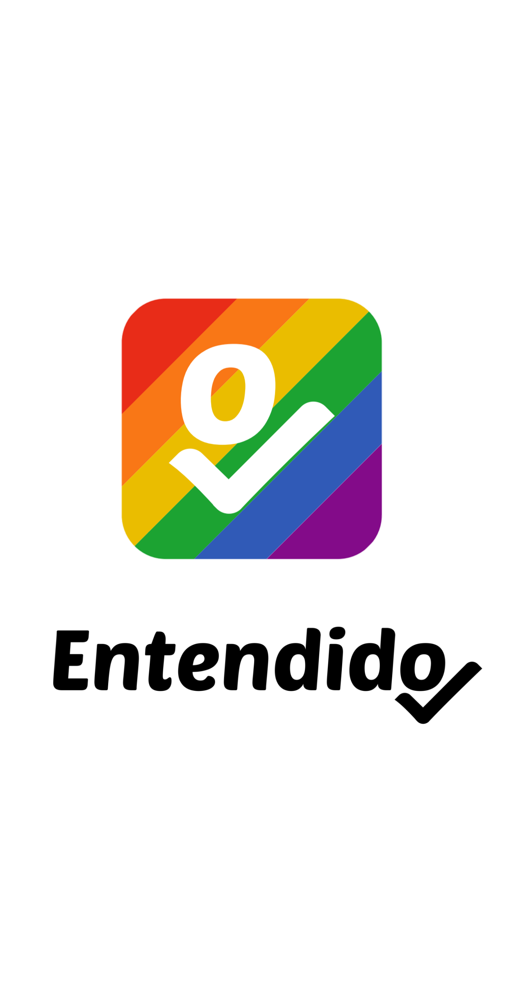

# 📱 Entendido: aplicativo para divulgação de eventos, profissionais e oportunidades de emprego e estudo para comunidade LGBTQIA+.

### O aplicativo foi submetido no evento Campus Mobile da Claro, realizado em 2020. Projeto desenvolvido e desenhado por <a href="github.com/hiimlex">Alex</a>.

  <h3 align="center">Splash Logo</h3>
    
   

    
   

